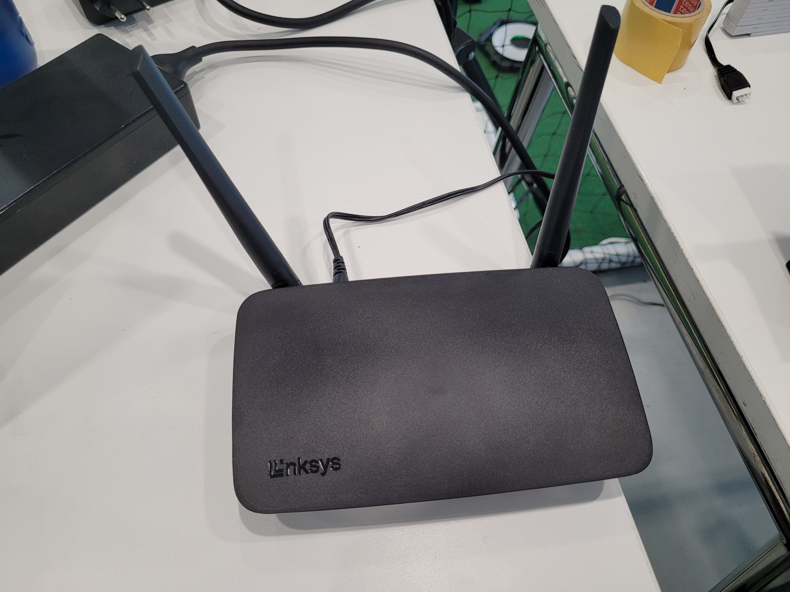
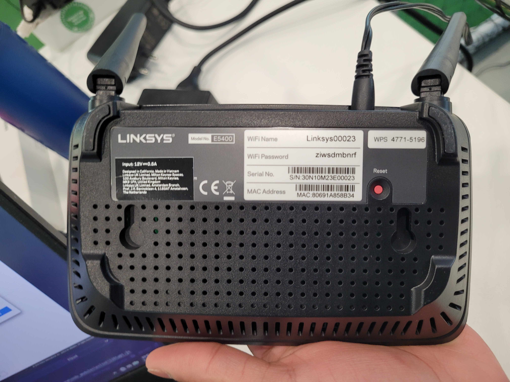
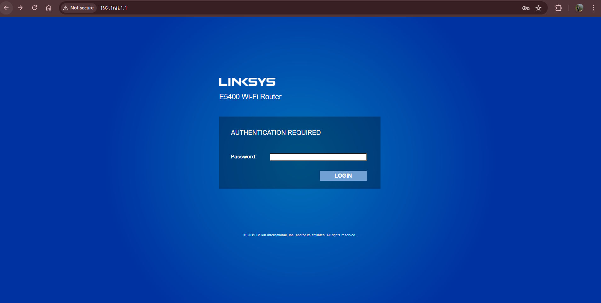
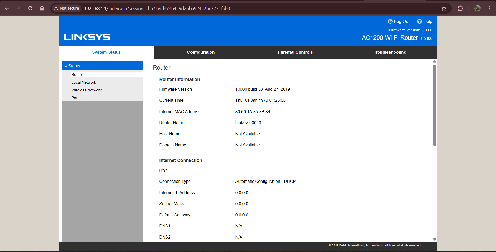
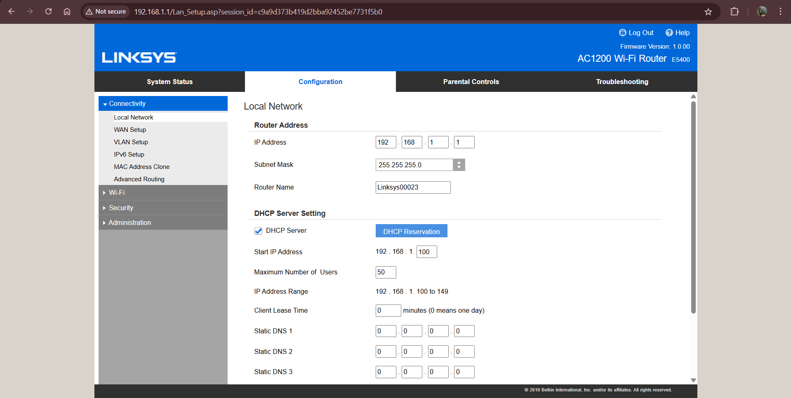
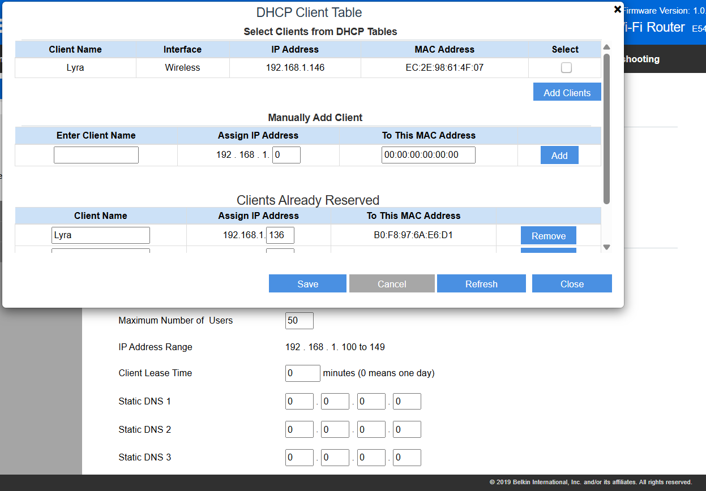
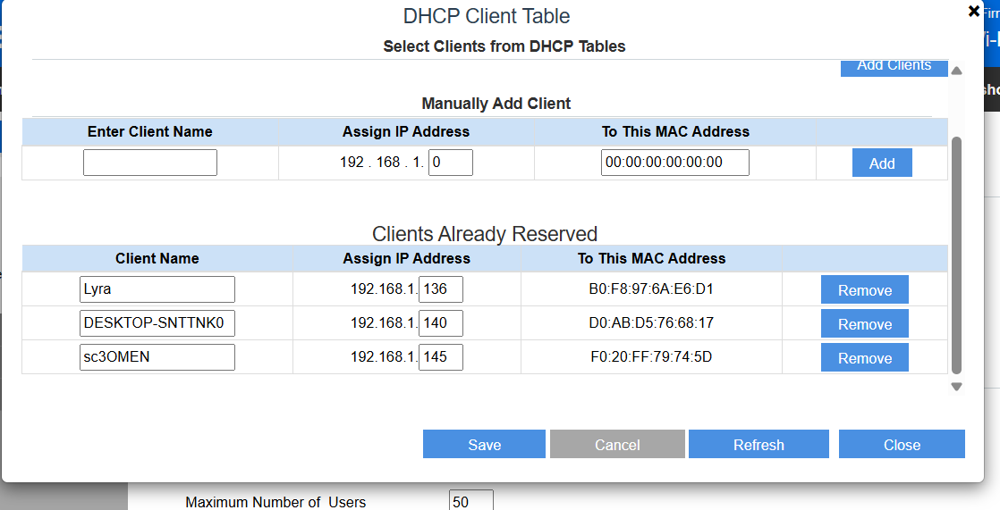

# 🛠️ One-Time Setup (Laptop)

Follow these steps once to prepare your laptop for the drone demo.

---

## 1. Clone the Repository

Open a terminal (e.g. CMD, PowerShell, or Terminal on Mac) and run:

```bash
git clone https://github.com/NienkeDriessen/DroneSwarm.git
cd DroneSwarm
```

Sudo apt install npm
npm install

## 2. Install Python Requirements

Ensure Python 3.10+ is installed. Then, create a virtual environment (optional but recommended):

```bash
python -m venv venv
venv\Scripts\activate  # On Windows
source venv/bin/activate  # On Mac/Linux
```

Install the required packages:

```bash
pip install -r requirements.txt
```

You're done! You only need to do this setup once per machine.

# If a new application host laptop is used
We use a router (which doesn't need internet access), to host our application over Local Area Network (LAN). Thus all devices (main swarming lab laptop, this app's host laptop, interfacing tablets/laptops, etc.) must first be connected to the router. It is shown below.



You can connect to the router via the credentials listed on the back of the router, seen below.

<p align="center">

</p>

## The app assumes a static IP address so we need to set this up for a new device

Once your new device is connected to the router. Open a browser tab, and navigate to the web address in the picture, i.e. `192.168.1.1 `



This webpage should appear, which is A login screen. the password is:  `admin`. This screen appears after you log in



Then Click on the configuration tab on the top bar. Click on connectivity sub-menu. And under local network, click on DHCP reservation button (in **blue** below)



**While your device is connected to the router**, you should be able to see the device, select it and click add clients.



THen in 'Clients already reserved'
You can assign an IP address, change it to

`192.168.1.145` ***(TODO CHECK)***

And remove the old one that was assigned with the same static IP



Be sure to save and then quit the app and then reconnect your device to the router. It should then be assigned the IP address you have set.

***Note:*** If you want to verify this
- On Windows, open a console and run `ipconfig`. Check the IPv4 address assigned by the router network connection
- on Linux/MacOS, open a console and run `ip -4 addr`. Check the IPv4 address assigned by the router network connection
